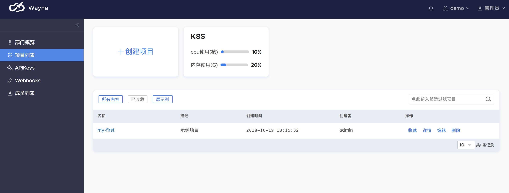
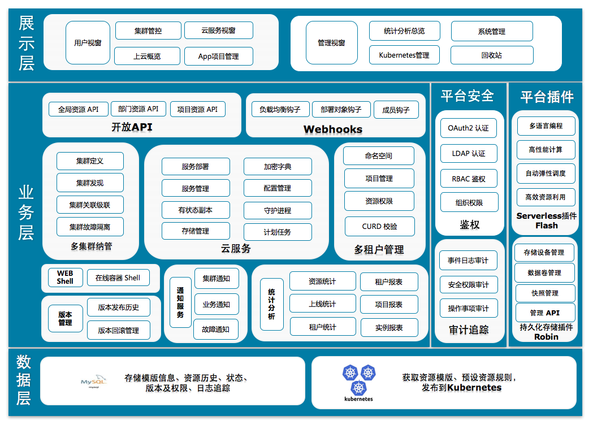

# Wayne

[](https://travis-ci.org/Qihoo360/wayne)
[](https://github.com/Qihoo360/wayne/releases)
[](https://github.com/Qihoo360/wayne/blob/master/LICENSE)
[](https://goreportcard.com/report/github.com/Qihoo360/wayne)

[English](https://github.com/Qihoo360/wayne/blob/master/README.md) | [中文](https://github.com/Qihoo360/wayne/blob/master/README-CN.md)

Wayne is a universal, web-based **[Kubernetes](https://kubernetes.io) multi-cluster management platform**. It reduces service access costs by visualizing Kubernetes object template editing.
With a complete permission management system and adapting to multi-tenant scenarios, it is a **publish platform** suitable for enterprise-level clusters.

Wayne has been serving [360 search](https://www.so.com/?src=wayne) on a large scale, carrying most of the online services, stably managing nearly a thousand applications, tens of thousands of containers, running for more than two years, withstood the test of production.

> Why Named **Wayne**:Most of the projects developed by the team of 360 ​​Search Private Cloud are named after DC comics, and [Wayne](https://en.wikipedia.org/wiki/Batman#Bruce_Wayne) is no exception. "Wayne" is the name of the famous superhero, Batman Bruce Wayne.



## Features

- Permissions management based on RBAC (Role based access control): Users are associated with departments and projects through roles, and department roles allow operations department resources, and project roles allow operation of project resources, which is more suitable for multi-tenant scenarios.
- Simplified the process of kubernetes object creation: Provides a basic Kubernetes object configuration file addition method, while supporting advanced mode to directly edit Json/Yaml files to create Kubernetes objects.
- LDAP/OAuth 2.0/DB Multiple login mode support: Integrate enterprise-level LDAP login and DB login mode, and also enable OAuth2 login.
- Support multi-cluster, multi-tenancy: You can manage multiple Kubernetes clusters at the same time, and add specific configurations to each other, making it easier for multi-cluster and multi-tenant management.
- Provide a complete auditing module: Wayne provides a complete auditing module (really named audit) for each operation, tracking for operational history, and support for user-defined webhook.
- Provide APIKey-based open interface calls: Users can apply for related APIKeys and manage their own departments and projects. Operation and maintenance personnel can also apply for global APIKey for global management of specific resources.
- Keep a complete release history: Users can easily find any historical release, easily roll back, and update Kubernetes resources based on a specific historical version.
- Complete resource reporting: Users can easily access reports and charts of resource usage and historical online frequency (days) and other basic data.
- Provide a Web shell based on strict permission checking: Users can enter the published Pod through the Web shell to operate, with full permission verification.
- Provide an in-site notification system: facilitates administrators to push clusters, service notifications, and troubleshooting reports.

## Architecture

The whole system adopts the separation of front and back ends, in which the front end uses Angular framework for data interaction and display, and the Ace editor is used for Kubernetes resource template editing. The backend uses the Beego framework for data interface processing, Client-go to interact with Kubernetes, and data for MySQL storage.



## Component

- Web UI:Provide complete business development and platform operation and maintenance experience.
- Worker:Extend a range of message queue-based features, such as auditing components such as Audit and Webhooks.

## Dependence

- Golang 1.12+ ([installation manual](https://golang.org/dl/))
- Docker 17.05+ ([installation manual](https://docs.docker.com/install))
- Bee ([installation manual](https://github.com/beego/bee))
- Node.js v11+ and npm 6.5+ ([installation with nvm](https://github.com/creationix/nvm#usage))
- MySQL 5.6+ (Most of the data is in MySQL.)

## Quickly Start

- Clone

```bash
$ git clone https://github.com/Qihoo360/wayne.git
```

- Start Wayne

  Start server by docker-compose at Wayne project.

```bash
$ docker-compose -f ./hack/docker-compose/docker-compose.yaml up
```

With the above command, you can access the local Wayne from http://127.0.0.1:4200, the default administrator account admin:admin.

> Note: After Wayne is started, you need to configure information such as cluster and Namespace for normal use. See details [Cluster Configuration](http://360yun.org/wayne/admin/cluster.html)

## Document

- Refer [Wiki](http://360yun.org/wayne/)

## Contact Us

Mail

redefine-infra@360.cn
